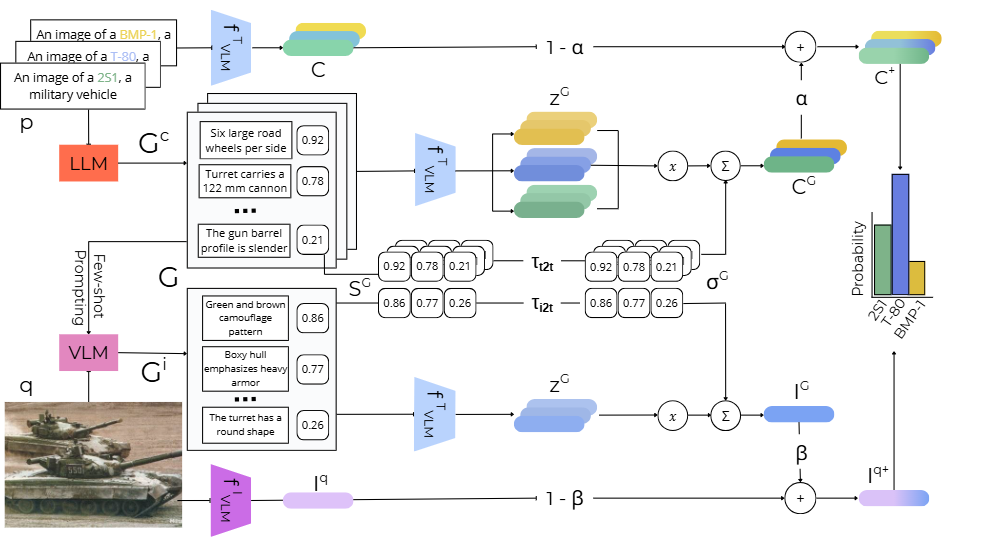

# SynCE: Synthetic Caption Enrichment

[](https://www.python.org/downloads/)
[](https://opensource.org/licenses/MIT)

Implementation of **"Synthetic Caption Enrichment for Fine-Grained Classification in Low-Resource Domains"** - MSc Thesis, University of Amsterdam, 2025.

## Overview

SynCE is a training-free, generation-based framework designed to improve zero-shot image classification in low-resource domains with fine-grained visual distinctions. Unlike retrieval-based methods that depend on external databases, SynCE synthesizes attribute-focused descriptions for both class labels and query images using Large Language Models (LLMs) and Vision-Language Models (VLMs).

### Key Features

- **Training-free**: No fine-tuning required - works out of the box
- **Dual-sided enrichment**: Enriches both image and class embeddings simultaneously
- **Dynamic weighting**: Adaptively fuses generated captions based on similarity scores
- **Model-agnostic**: Compatible with various VLM classifiers (CLIP, SigLIP, PerceptionEncoder)
- **Domain-flexible**: Easily adaptable to new specialized domains

### Architecture

SynCE operates through a two-stage generation process:
1. **Class-side generation**: LLM generates attribute-focused descriptions for candidate classes
2. **Image-side generation**: VLM generates structurally-aligned captions for query images

At inference time, these captions are encoded and fused with original embeddings using controllable fusion parameters (α, β) and temperature-based similarity weighting.





## Getting Started

### Installation
```bash
git clone https://github.com/Jellemvdl/SynCE.git
cd synce
pip install -r requirements.txt
```

## Running SynCE

### Step 1: Generate Class-Side Captions

Generate attribute-focused descriptions for your class labels using an LLM:
```bash
python src/txt2txt_generation.py \
    --dataset your_dataset \
    --model gpt-4o \
    --num_captions 20
```

**Output**: Saves class descriptions to `generated_captions/class_side/your_dataset.json`

### Step 2: Generate Image-Side Captions

Generate image captions using few-shot prompting with the class-side captions:
```bash
python src/img2txt_fewshot_generation.py \
    --dataset your_dataset \
    --image_root '/path/to/images'
    --num_captions 5 
```

**Output**: Saves image descriptions to `generated_captions/image_side/your_dataset.json`

### Step 3: Run SynCE Classification

#### Option A: Fixed Parameters

Run SynCE with specific hyperparameters:
```bash
python src/synce.py \
    --dataset your_dataset \
    --model_name SigLIP \
    --alpha 0.2 \
    --beta 0.1 \
    --temp_t2t 0.1 \
    --temp_i2t 0.1
```

**Key parameters**:
- `--classifier`: VLM classifier (options: `siglip`, `PE-L`, `PE-G`)
- `--alpha`: Class-side fusion weight [0,1] (default: 0.2)
- `--beta`: Image-side fusion weight [0,1] (default: 0.1)
- `--temp_t2t`: Temperature for class-side similarity scores
- `--temp_i2t`: Temperature for image-side similarity scores

#### Option B: Hyperparameter Sweep

Search for optimal parameters:
```bash
python src/synce.py \
    --dataset your_dataset \
    --classifier SigLIP \
    --alpha_min 0.0 \
    --alpha_max 0.6 \
    --alpha_step 0.1 \
    --beta_min 0.0 \
    --beta_max 0.6 \
    --beta_step 0.1 
```

**Output**: Saves results and best parameters to `sweep_results/`

#### Option C: Uniform Weighting (No Dynamic Weighting)

Run SynCE without similarity-based weighting:
```bash
python src/synce_uniform.py \
    --dataset your_dataset \
    --classifier SigLIP \
    --alpha 0.2 \
    --beta 0.1
```

This averages all captions uniformly instead of weighting by similarity scores and can also be used for sweeping the most optimal alpha and beta values, by not setting the parameters to a static value. 

## Reproduced Baselines

The `submodules/` folder contains implementations of baseline methods:

### CoRE (Combination of Retrieval Enrichment)
```bash
cd submodules/core
```

### WDYS (What Do You See?)
```bash
cd submodules/wdys
```

## Utilities

The `utils/` folder contains scripts for reproducing paper results:

- `ablation_studies.py`: Run ablation experiments on fusion strategies
- `attention_visualization.py`: Generate attention heatmaps (based on WDYS method)
- `evaluate_metrics.py`: Compute detailed classification metrics
- `tsne_visualization.py`: Visualize embedding spaces


## Results

Our method achieves significant improvements on low-resource datasets:

| Dataset | Baseline | CoRE | SynCE | Improvement |
|---------|----------|------|-------|-------------|
| Military-Vehicles-18 | 75.53% | 74.51% | **76.44%** | +0.91% |
| Patch-Camelyon | 69.74% | - | **78.18%** | +8.44% |
| Parasitic Egg | 12.72% | 15.14% | **16.89%** | +1.75% |

See the [thesis](files/Master_Thesis.pdf) for complete results and analysis.


**Note**: This implementation requires access to API keys for certain LLMs (e.g., GPT-4o). Set your API keys as environment variables before running:
```bash
export OPENAI_API_KEY="your-key-here"
```
